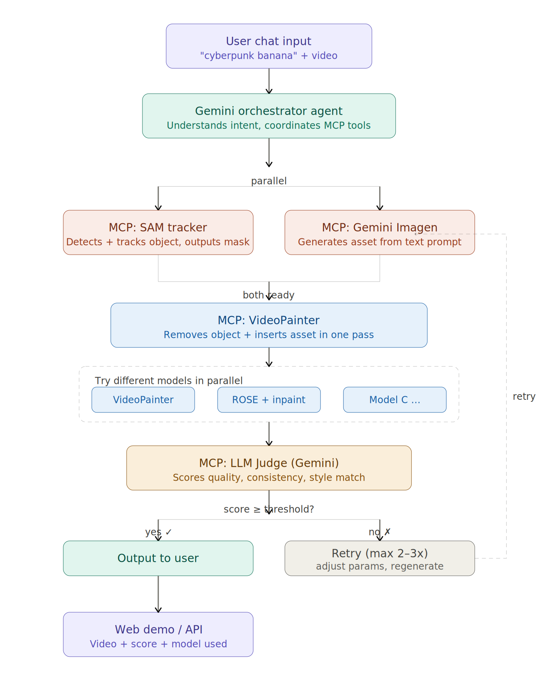

# editAnything 

Replace an object in a video with a described one (e.g. **cup → banana**), across
the whole clip, decoupling three independent components:

- **SAM3** — segments/tracks the object to remove → per-frame masks.
- **Gemini** — edits one frame in place → a clean reference of the new object.
- **VideoPainter** — generates the new object into the masked region and keeps it
  consistent across the video (CogVideoX-5B-I2V + branch + VideoPainterID LoRA).

These are **separate stages that exchange files**; VideoPainter never calls SAM3 or
Gemini (unlike the original `submodules/VideoPainter/app/app.py` Gradio demo). FLUX is not used.

## Environment setup (only what we need)

One conda env (`editanything`, Python 3.10, torch 2.4 / cu121) runs everything we
use. We deliberately skip the heavy parts of a full VideoPainter install that our
pipeline does NOT use: **FLUX.1-Fill-dev (~24 GB)**, the SAM2 CUDA extension, and
the Gradio app (so no `OPENAI_API_KEY`).

```bash
# 0. clone WITH submodules (VideoPainter + sam3 are pinned git submodules, gitignored ckpt)
git clone --recurse-submodules https://github.com/yining-li115/editAnything.git && cd editAnything
#  (already cloned without --recurse-submodules? run:  git submodule update --init)

# 1. env + the diffusers fork we actually use (submodules/VideoPainter/ is the checkout)
conda create -n editanything python=3.10 -y && conda activate editanything
cd submodules/VideoPainter
pip install -r requirements.txt
pip install -e ./diffusers           # CogVideoX branch / id_pool pipeline lives here
conda install -c conda-forge ffmpeg -y
cd ../..
#  Do NOT run `cd app && pip install -e .` — that builds the SAM2 ext we don't use.

# 2. SAM3 (the submodules/sam3 submodule) into the SAME env without disturbing torch 2.4
cd submodules/sam3
pip install -e . --no-deps --config-settings editable_mode=compat   # compat REQUIRED (else sam3.__file__ is None)
pip install timm ftfy==6.1.1 regex iopath typing_extensions "setuptools<81" pycocotools
cd ../..
python -c "import sam3; print(sam3.__file__)"   # must print a real path, not None

# 3. HuggingFace + checkpoints into the top-level ckpt/ (gitignored) — NO FLUX
pip install "huggingface_hub==0.24.1"   # keep <1.0 (transformers 4.42.2); use the old huggingface-cli
huggingface-cli login                    # first request access at https://huggingface.co/facebook/sam3
huggingface-cli download TencentARC/VideoPainter --local-dir ckpt          # branch + VideoPainterID -> ckpt/
huggingface-cli download THUDM/CogVideoX-5b-I2V  --local-dir ckpt/CogVideoX-5b-I2V
#  We do NOT download black-forest-labs/FLUX.1-Fill-dev (flux_inp) — not used (~24 GB saved).
#  SAM3 weights auto-download on first build (gated facebook/sam3).

# 4. Gemini edit stage (optional)
pip install google-genai
cp .env.example .env && $EDITOR .env     # set GEMINI_API_KEY

# 5. RoMa anchor/mask propagation (--backend roma) — keep torch 2.4
pip install romatch --no-deps && pip install loguru einops   # do NOT let it pull torch>=2.5

# 6. RIFE smoothing (--interpolate) — prebuilt rife-ncnn-vulkan binary (Vulkan/GPU,
#    ships its own models). Needs a Vulkan loader (libvulkan.so.1 — provided by the
#    NVIDIA driver; check with `ldconfig -p | grep libvulkan`). Download + extract
#    under the repo parent's tools/ (commands run from editAnything/):
mkdir -p ../tools && cd ../tools
wget https://github.com/nihui/rife-ncnn-vulkan/releases/download/20221029/rife-ncnn-vulkan-20221029-ubuntu.zip
unzip -q rife-ncnn-vulkan-20221029-ubuntu.zip
chmod +x rife-ncnn-vulkan-20221029-ubuntu/rife-ncnn-vulkan
cd ../editAnything
export RIFE_BIN="$(cd .. && pwd)/tools/rife-ncnn-vulkan-20221029-ubuntu/rife-ncnn-vulkan"
#   sanity-check it runs (rife-v4.6 model ships inside the zip, next to the binary;
#   matches encode.py's RIFE_MODEL default):
#     "$RIFE_BIN" -0 a.png -1 b.png -o mid.png -m "$(dirname "$RIFE_BIN")/rife-v4.6"
#   NOTE: set RIFE_BIN explicitly as above — encode.py's built-in fallback path is a
#   stale absolute path (/root/project/tools/...) and won't match a fresh checkout.
```

### ROSE removal env (optional — only for `--removal rose`)

ROSE removes the source object **and its shadow/reflection** → a clean plate. It needs
its OWN env (Python 3.12, torch 2.6 / cu124, stock diffusers) — incompatible with
`editanything` (torch 2.4 + VideoPainter's diffusers fork) — so it runs as a subprocess.
Skip this whole section unless you use `--removal rose`.

```bash
# 1. separate env + ROSE deps (torch 2.6 / cu124)
conda create -n rose python=3.12 -y
conda run -n rose pip install torch==2.6.0 torchvision==0.21.0 --index-url https://download.pytorch.org/whl/cu124
conda run -n rose pip install -r submodules/ROSE/requirements.txt
conda run -n rose pip install "transformers==4.46.2"   # pin <5 (diffusers 0.31 needs FLAX_WEIGHTS_NAME)

# 2. weights into top-level ckpt/ROSE/ (gitignored): ROSE transformer + Wan2.1-Fun base
huggingface-cli download Kunbyte/ROSE --local-dir ckpt/ROSE/weights
mkdir -p ckpt/ROSE/weights/transformer
mv ckpt/ROSE/weights/config.json ckpt/ROSE/weights/diffusion_pytorch_model.safetensors ckpt/ROSE/weights/transformer/
huggingface-cli download alibaba-pai/Wan2.1-Fun-1.3B-InP --local-dir ckpt/ROSE/models/Wan2.1-Fun-1.3B-InP

# 3. symlink weights into the paths ROSE's inference.py expects (run from repo root)
ln -sfn "$(pwd)/ckpt/ROSE/models"  submodules/ROSE/models
ln -sfn "$(pwd)/ckpt/ROSE/weights" submodules/ROSE/weights
```

`components/removal.py` invokes this env via `ROSE_PYTHON` (default `/venv/rose/bin/python`;
set it to your env, e.g. `export ROSE_PYTHON="$(conda info --base)/envs/rose/bin/python"`).
ROSE resizes to 480×720 and needs clip length `16n+1`.

### Runtime env vars (set before running)

```bash
export HF_HOME=/workspace/.hf_home                      # HF cache (gated SAM3 weights)
export HF_TOKEN=$(cat /root/.cache/huggingface/token)   # HF auth for gated facebook/sam3
export RIFE_BIN=/root/tools/rife-ncnn-vulkan-20221029-ubuntu/rife-ncnn-vulkan  # for --interpolate
export PYTORCH_CUDA_ALLOC_CONF=expandable_segments:True # reduce CUDA fragmentation / OOM
```

- **`HF_HOME`** — HuggingFace cache root; SAM3 (gated `facebook/sam3`) loads its weights from here.
- **`HF_TOKEN`** — auth token for the gated SAM3 download. Needed because setting `HF_HOME` stops the hub from finding the default `~/.cache/huggingface/token`.
- **`RIFE_BIN`** — path to the `rife-ncnn-vulkan` binary, used by `--interpolate` (RIFE de-spike); `encode.py`'s built-in fallback path is stale.
- **`PYTORCH_CUDA_ALLOC_CONF=expandable_segments:True`** — lowers CUDA memory fragmentation; helps avoid OOM when VRAM is tight.

Checkpoint layout we rely on (top-level `ckpt/`, gitignored; paths come from
`contracts/layout.py`'s model registry):

```
ckpt/
├── VideoPainter/checkpoints/branch     # CogvideoXBranchModel
├── VideoPainterID/checkpoints          # VideoPainterID LoRA
└── CogVideoX-5b-I2V                     # base I2V DiT
```

Gotchas (learned the hard way):

- Keep `huggingface_hub < 1.0` and `ftfy==6.1.1`, `setuptools<81` (sam3 uses
  `pkg_resources`). If `decord` import fails (non-x86_64): `pip install eva-decord`.
- Activate the `editanything` conda env before running (it holds the torch 2.4 /
  sam3 / diffusers-fork installs).

Full original setup notes (incl. the parts we dropped) live in `../SERVER_SETUP.md`.

## Data preprocessing (prepare the inputs)

The pipeline consumes: a **video** (or pre-extracted frames) + a frame-0 reference
**`ref0`** showing the NEW object in place — the only generative input besides the
video. Make `ref0` with the Gemini edit stage:

```bash
# A) describe the new object
python -m components.gemini_edit --image frame_00001.png --out ref0.png --source cup --target "a ripe yellow banana"
# B) supply an image of the exact object you want
python -m components.gemini_edit --image frame_00001.png --out ref0.png --source cup --ref_image my_banana.png
```

Needs `pip install google-genai` + `GEMINI_API_KEY` (see `.env.example`). The edit
must stay pixel-aligned with frame 0. (`--backend assets` skips this — uses prepared
anchors + masks instead.)

## Run

**Entry point: [`pipeline.py`](pipeline.py)** — the end-to-end runner. Set the env
vars above, then e.g.:

```bash
python pipeline.py --config config.yaml --max_frames 100 --name cup_100
```

- **`--config config.yaml`** — all task + pipeline params (source/target/prompt, `backend`,
  `ref0`, `removal`, sampling, output…); see the file's comments. Any value is overridable on the CLI.
- **`--max_frames 100`** — process only the first 100 frames (omit → the whole clip).
- **`--name cup_100`** — run name; outputs land in `outputs/cup_100/`.
- Other overrides: `--seed 7`, `--removal none`, `--segment_starts 0` (one chunk), `--backend assets`, …

Outputs land in `outputs/<name>/`. Handy debug flags:

- **Stop early:** `--stop_after extract|mask|generate|removal|composite|encode`
- **Test one stage (toggle):** `python stage.py --config config.yaml --stage <extract|sam3|edit_mask|anchor|removal|generate|composite|encode>` — config-driven defaults, any input overridable (e.g. `--stage composite --plate_dir <clean> --object_dir <gen>`). Each component also has its own `python -m components.<x>` CLI.

## How it works (brief)

- **`backend: roma`** (any video): SAM3 masks the new object on `ref0` + the old object
  on frame 0 → frame-0 edit region; `roma_warp` dense-warps it to every frame (edit masks)
  and warps the whole `ref0` to each segment start (anchors). Only needs `ref0`.
- **Length:** base model = 49 frames/pass; ≤49 → single pass, else multi-chunk reanchor,
  segment starts auto-derived from the frame count.
- **`--interpolate`** (RIFE de-spike): swaps each segment-boundary anchor frame for
  `RIFE(n-1, n+1)` to kill the one-frame reanchor "pop" (native fps; needs `RIFE_BIN`).

## Key params (`config.yaml`)

| param | default | note |
| --- | --- | --- |
| `backend` | `roma` | `roma` (any video) / `assets` (prepared) |
| `dilate` | 12 | edit-region padding (px) — **not yet scale-relative; applied at both mask + generate** |
| `steps` / `guidance` | 50 / 6.0 | DPM-trailing sampling |
| `seed` | 42 | reproducibility |
| `segment_starts` | auto | `0,48,96,…` once past 49 frames |
| `out_size` / `fps` | 480x832 / 25 | final portrait |
| `interpolate` | true | RIFE boundary de-spike |

Internals: 720×480 work res, `id_pool_resample_learnable=True`, sequential CPU offload +
VAE tiling; ~11 min/segment, ~22 GB peak. RoMa backend skips composite (warped-anchor
composite would ghost the hand).

## What we actually use from the `submodules/VideoPainter` submodule

`submodules/VideoPainter` is a pinned submodule of upstream `TencentARC/VideoPainter`
(no fork, no patches). We only use:

- `submodules/VideoPainter/diffusers/` — the custom fork providing
  `CogVideoXI2VDualInpaintAnyLPipeline`, `CogvideoXBranchModel`, and the id_pool
  `CogVideoXTransformer3DModel`.
- the checkpoints in top-level `ckpt/{CogVideoX-5b-I2V, VideoPainter/checkpoints/branch, VideoPainterID/checkpoints}`.

Not used: `app/` (Gradio), `app/sam2*`, `utils.py`'s FLUX path, `flux_inp`,
`train/`, `evaluate/`, `infer/`, `data_utils/`.

## Code layout

Capability logic, MCP layer, and agents are separated so each stage is an
isolated, independently-wrappable unit (dependency direction:
`contracts ← components ← (mcp) ← (agents)`).

| Path                       | Role                                                          |
| -------------------------- | ------------------------------------------------------------ |
| `components/extract.py`    | video → frames + frame-set queries                           |
| `components/sam3_mask.py`  | SAM3 text prompt → per-frame (or single-image) mask          |
| `components/gemini_edit.py`| Gemini API → in-place frame edit (the new-object reference)  |
| `components/roma_warp.py`  | low-level RoMa match + warp primitives (shared)              |
| `components/edit_mask.py`  | per-frame edit region — **generic, cross-candidate** (roma/assets) |
| `components/anchor.py`     | per-segment clean anchors — **VideoPainter-specific** (roma/assets) |
| `components/videopainter.py`| VideoPainter multi-chunk reanchor generation (**models loaded once**) |
| `components/composite.py`  | feather the object onto a fixed plate (kills chunk-boundary jumps) |
| `components/encode.py`     | frames → portrait mp4 (+ optional RIFE de-spike)             |
| `contracts/layout.py`      | run-dir layout + config-driven model registry (ckpt paths)  |
| `pipeline.py`              | end-to-end local runner (wires the components)              |

## Known limitations

- **`dilate` is fixed pixels, not scale-relative.** The edit-region margin is a fixed
  px value, so it isn't resolution/object-size invariant. Making it proportional to
  object size is the next refinement (and a future tuning-agent knob).
- **ROSE runs the whole clip in one pass.** It processes `16n+1` frames in a single
  diffusion call, so very long clips are VRAM-heavy; chunking ROSE for long videos is
  open. Also, `--removal rose` covers the shadow only where it falls *outside* the edit
  mask (inside the mask comes from the generated frame).
- **Source shadow** is handled (ROSE clean-plate via `--removal rose`); the **edit
  region** is now a rotated-rect / hull of (target∪source), not a rigid bbox.

## Roadmap (agentic)

**Goal:** turn today's fixed script into an **agentic** system — a Gemini
orchestrator that calls each capability on demand as an MCP tool, runs candidates
in parallel, and self-corrects from an LLM judge's feedback instead of us
hand-tuning params. Target architecture (`system_pipeline.png`):



What this requires, in build order:

1. **Wrap each stage as an MCP tool** — SAM3 mask, Gemini edit/Imagen asset, RoMa
   propagate, ROSE removal, VideoPainter generate, composite, encode. Today they
   are functions chained in `pipeline.py`; the orchestrator needs to call them
   individually.
2. **Gemini orchestrator agent** — parses the chat request ("cyberpunk banana" +
   video) into intent (source object, target object, style), then fans out:
   SAM tracker and Imagen/Gemini-edit run **in parallel**, and generation starts
   once both the mask and the asset are ready.
3. **Parallel model candidates** — run VideoPainter, a ROSE-removal+inpaint path,
   and future models on the same input concurrently, so the judge can pick the
   best result rather than us committing to one backend up front.
4. **LLM judge (Gemini)** — scores each candidate on quality, temporal
   consistency, and style match against the request; the best score above a
   threshold is returned, with the score and model surfaced to the user.
5. **Self-correcting retry loop** — on a below-threshold score, the orchestrator
   retries (2–3×) by **adjusting params and regenerating** — this is where the
   **tuning agent** lives, picking `dilate`, segment split, mask shape, etc. from
   the judge's feedback instead of us tuning them by hand.
6. **ROSE removal as a component** — a clean-plate removal stage that fixes the
   leftover source-object shadow (see Known limitations) and re-enables the
   original composite path.

The current `pipeline.py` is the single-backend, no-judge slice of this: it runs
the SAM3 → edit → VideoPainter chain end to end with params fixed in
`config.yaml`. The agentic version keeps these same stages but lets the
orchestrator choose, parallelize, score, and retry them.

## TODO

What's done vs. still open.

**Done**

- [x] SAM3 text-prompt source mask (`components/sam3_mask.py`)
- [x] Gemini frame-0 edit / reference (`components/gemini_edit.py`)
- [x] RoMa edit-mask + anchor propagation, any-length video (`components/roma_warp.py`, `edit_mask.py`, `anchor.py`)
- [x] VideoPainter inpainting-only generation, multi-chunk reanchor, models loaded once (`components/videopainter.py`)
- [x] Composite + portrait encode + RIFE anchor de-spike (`components/composite.py`, `encode.py`)
- [x] End-to-end fixed-param pipeline driven by `config.yaml` (`pipeline.py`)
- [x] Decoupled components + `contracts/` registry; VideoPainter & sam3 as git submodules
- [x] **Source-object shadow removal** — ROSE clean-plate removal (`components/removal.py`, separate `rose` env) + composite the new object onto the clean plate, via `--removal rose` (Role-1 post-processing). Verified on 100 frames.
- [x] **Irregular-hull edit region** — frame-0 (target∪source) close+dilate hull (not bbox), RoMa-warped per frame (`components/edit_mask.py`); ~0.56× the bbox area, hugs the object.

**Open — quality**

- [ ] **Scale-relative dilate** — make the edit-region `dilate` proportional to object size (currently fixed px), so it's resolution/scale-invariant.

**Open — agentic system** (see Roadmap)

- [ ] Wrap each stage as an **MCP tool** (SAM3, Gemini edit/Imagen, RoMa, ROSE, VideoPainter, composite, encode)
- [ ] **Gemini orchestrator agent** — parse chat intent, fan out SAM + asset generation in parallel
- [ ] **Parallel model candidates** — run VideoPainter / ROSE+inpaint / future models concurrently
- [ ] **LLM judge (Gemini)** — score quality / temporal consistency / style match, pick best above threshold
- [ ] **Self-correcting retry loop / tuning agent** — auto-pick `dilate`, segment split, mask shape from judge feedback (2–3× retries)
- [ ] **ROSE removal component** — clean plate, re-enables the original composite path
- [ ] **Web demo / API** — return video + score + which model was used